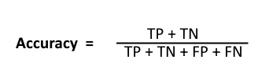
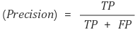
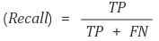
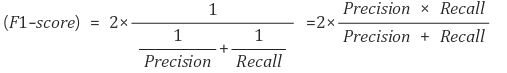
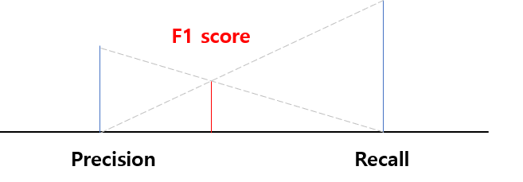
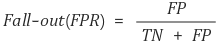
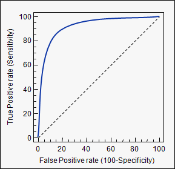

# Confusion Matrix

> 머신러닝 및 딥러닝 모델에 대한 성능평가를 위한 지표작성
>
> 분류 모델에 적용함


> 출처: https://www.geeksforgeeks.org/confusion-matrix-machine-learning/

### 케이스 분류

- Positive: 비가 온다(예시).
- Negative: 비가 안온다(예시).

1. True Positive(TP) : 실제 True인 정답을 True라고 예측, `비가온다`고 예측했고 `실제로 비가 왔다`.**(정답)**
2. False Positive(FP) : 실제 False인 정답을 True라고 예측, `비가온다`고 예측했지만 `실제로 비가 안왔다`.(오답)
3. True Negative(TN) : 실제 False인 정답을 False라고 예측, `비가 안온다`고 예측했고 `실제로 비가 안왔다`.(오답)
4. False Negative(FN) : 실제 True인 정답을 False라고 예측, `비가 안온다`고 예측했지만 `실제로 비가 왔다`.**(정답)**


### 평가항목

> 1. 결론부터 미리 말하면 정밀도와 재현율 각각 높을수록 좋다.
>
> 2. 정밀도가 낮고 회수율이 높은경우 대부분의 Positive가 올바르게 인식되지만(FN값이 낮음), 많은 FP 값이 많다.
> 3. 정밀도가 높고 회수율이 낮은경우 많은 Positive가 올바르게 인식되지 못하지만(FN값이 높음), 긍정적으로 예측하는것은 실제로 긍적적이다 .(FP 값이 낮다)
>
> 3. 정밀도와 재현율의 조화평균인 F1 score를 잘 보자

1. Accuracy (정확성)

   - 모델이 예측한 것 중 실제로 True인 항목에 대한 비율
   - 모델이 예측한 항목중 실제로 맞춘(정답) 애들
   - 정확성에는  P와N 두 종류의 오류에 대해 동일한 비용을 가정한다는 문제가 있다. 99 %의 정확도는 문제에 따라 우수, 양호, 평범하거나 열악하거나 끔찍할 수 있다.
   
   
2. Precision(정밀도)
   - 모델이 Positive라고 분류한 것 중 실제로 True인 것에 대한 비율
   - 모델이 비가 온다고 분류한 것 중 실제로 True인 것
   - `PPV(Positive Predictive Value)` 라고도 불림
   
   
3. Recall(재현율)
   - 실제 True 인 것중에 모델이 True라고 예측한 것의 비율
   - 실제 비가온다고 가정하고 모델예측결과가 비가온다고 가정한 비율
   - 헷깔릴수도 있다. **실제 비가 온다는 것을 전제로 생각해야 한다.**
   

```
통계학에서는 sensitivity으로, 그리고 다른 분야에서는 hit rate라는 용어로도 사용합니다. 실제 날씨가 맑은 날 중에서 모델이 맑다고 예측한 비율을 나타낸 지표인데, 정밀도(Precision)와 True Positive의 경우를 다르게 바라보는 것입니다. 즉, Precision이나 Recall은 모두 실제 True인 정답을 모델이 True라고 예측한 경우에 관심이 있으나, 바라보고자 하는 관점만 다릅니다. Precision은 모델의 입장에서, 그리고 Recall은 실제 정답(data)의 입장에서 정답을 정답이라고 맞춘 경우를 바라보고 있습니다. 다음의 경우를 생각해보겠습니다.

"어떤 요소에 의해, 확실히 맑은 날을 예측할 수 있다면 해당하는 날에만 맑은 날이라고 예측하면 되겠다."

이 경우에는 확실하지 않은 날에는 아에 예측을 하지 않고 보류하여 FP의 경우의 수를 줄여, Precision을 극도로 끌어올리는 일종의 편법입니다. 예를 들어 한달 30일 동안 맑은 날이 20일이었는데, 확실한 2일만 맑다고 예측한다면, 당연히 맑다고 한 날 중에 실제 맑은 날(Precision)은 100%가 나오게 됩니다. 하지만 과연, 이러한 모델이 이상적인 모델일까요?

따라서, 우리는 실제 맑은 20일 중에서 예측한 맑은 날의 수도 고려해 보아야합니다. 이 경우에는 Precision만큼 높은 결과가 나오지 않습니다. Precision과 함께 Recall을 함께 고려하면 실제 맑은 날들(즉, 분류의 대상이 되는 정의역, 실제 data)의 입장에서 우리의 모델이 맑다고 예측한 비율을 함께 고려하게 되어 제대로 평가할 수 있습니다. Precision과 Recall은 상호보완적으로 사용할 수 있으며, 두 지표가 모두 높을 수록 좋은 모델입니다.

참고: https://sumniya.tistory.com/26
```


4. F1-Score

   - Precision과 Recall의 조화평균

   - 데이터 Label이 불균형 구조일 때, 모델의 성능을 정확하게 평가할 수 있음
   
   - 성능을 하나의 숫자로 표기할 수 있음
   
     
     


5. 2.1 Fall-out
   - Fall-out은 **FPR(False Positive Rate)**으로도 불리며, 실제 False인 data 중에서 모델이 True라고 예측한 비율입니다. 즉, 모델이 실제 false data인데 True라고 잘못 예측(분류)한 것으로 다음과 같이 표현할 수 있습니다.
   

6. ROC(Receiver Operating Characteristic) curve
   - 여러 임계값들을 기준으로 Recall-Fallout의 변화를 시각화한 것입니다. Fallout은 실제 False인 data 중에서 모델이 True로 분류한, 그리고 Recall은 실제 True인 data 중에서 모델이 True로 분류한 비율을 나타낸 지표로써, 이 두 지표를 각각 x, y의 축으로 놓고 그려지는 그래프를 해석합니다. 아래 예시를 보죠.
   
   
> Image Source: https://www.medcalc.org/manual/roc-curves.php

   - curve가 왼쪽 위 모서리에 가까울수록 모델의 성능이 좋다고 평가합니다. 즉, Recall이 크고 Fall-out이 작은 모형이 좋은 모형인 것입니다. 또한 y=x 그래프보다 상단에 위치해야 어느정도 성능이 있다고 말할 수 있습니다.

7. AUC(Area Under Curve)
   - ROC curve는 그래프이기 때문에 명확한 수치로써 비교하기가 어렵습니다. 따라서 그래프 아래의 면적값을 이용합니다. 이것이 바로 **AUC(Area Under Curve)**입니다. 최대값은 1이며 좋은 모델(즉, Fall-out에 비해 Recall 값이 클수록) 1에 가까운 값이 나옵니다.


### 참고

1. 참고1: https://sumniya.tistory.com/26