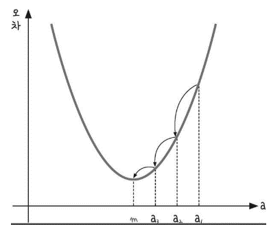
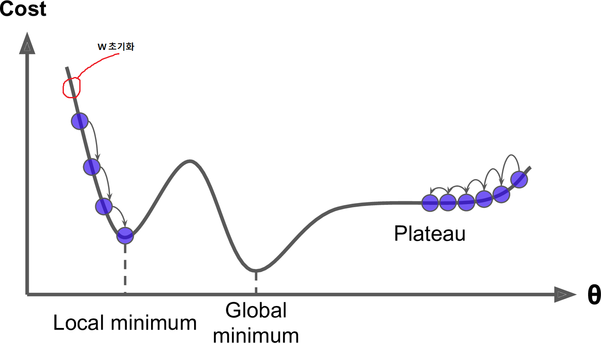
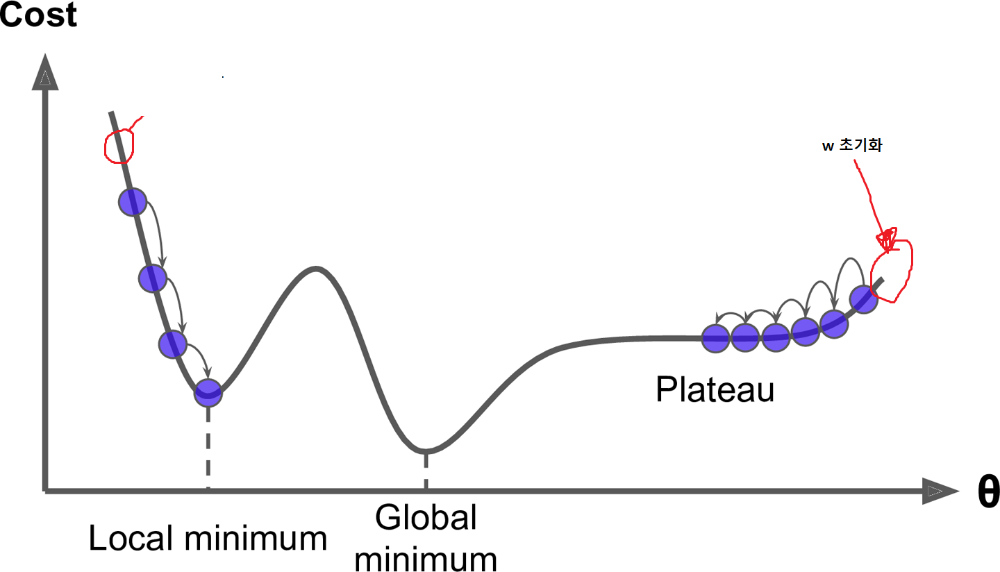
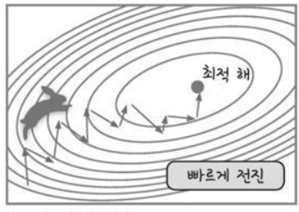
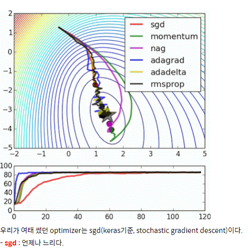

## Gradient descent(경사 하강법)

> 1. 미분 기울기를 이용하는 **경사 하강법(gradient decent)**은 이차 함수 그래프에서 오차를 비교하여 가장 **작은 방향으로 이동시키는 방법**
>2. 기본 개념은 함수의 [기울기](https://ko.wikipedia.org/wiki/기울기_(벡터))(경사)를 구하여 기울기가 낮은 쪽으로 계속 이동시켜서 [극값](https://ko.wikipedia.org/wiki/극값)에 이를 때까지 반복시키는 것
> 3. 즉, Cost(loss)의 w편미분을 통해 w의 변화량을 구해서 가져와 Gradient descent를 태우면 랜덤으로 초기화된 w라 하더라도 어느순간 좋은 w를 찾아가는 학습이 이루어짐

#### 평가

- 경사 하강법은 모든 차원과 모든 공간에서의 적용이 가능하다. 심지어 무한 차원상에서도 쓰일 수 있다. (이 경우 해당 차원이 만들어내는 공간을 [함수 공간](https://ko.wikipedia.org/wiki/함수_공간)이라고 한다.)

#### 문제점

1. Global Optima에 도달하지 못할 수 가능성
   
   - 정확성을 위해서 [극값](https://ko.wikipedia.org/wiki/극값)으로 이동함에 있어 매우 많은 단계를 거쳐야하며, 주어진 함수에서의 [곡률](https://ko.wikipedia.org/wiki/곡률)에 따라서 거의 같은 위치에서 시작했음에도 불구하고 완전히 다른 결과로 이어질 수도 있다.
   
   - 함수 최적화 방법인 경사하강법 알고리즘은 **그리디 접근방식**을 사용한다. 이것은 즉 **휴리스틱(heuristic)**한 탐색을 하기 때문에 Local Optima(Minimum)을 가지게 되어 Global Optima(minimum)으로 도달하지 못할 수 있다.
   
   
   
   
   
   > 하지만 요즘 트렌드에 의하면 딥러닝에서는 로컬 옵티마에 빠질 확률이 거의 없다고 한다. 
   >
   > 위 그래프는 w가 1개인 모델이지만 실제 딥러닝 모델에서는 w가 수도없이 많고, 모든 w가 로컬 옵티마에 빠져야 w 업데이트가 정지 된다고 한다.

2. Plateau(평지)에 머무를 가능성
   - 아래와 같이 w가 저 위치에 초기화 되었을 경우 평지가 생겨 더이상 loss 업데이트가 되지 않는 현상을 Plateau 현상이라 한다.
   
   - 이 현상이 로컬 옵티마에 비해 **발생확률이 정말 높다**
   - **Gradient Optimization**(Gradient를 태우는 알고리즘)을 통해 해결이 가능하다

3. Zigzag 현상

   >  Activation func로 sigmoid 또는 ReLU를 사용할 경우 w 업데이트행렬의 부호가 모두 동일하여, 원하는 방향(+ 또는 -)으로 가지 못해 , 지그재그로 w 목표점을 찾아가는 현상
   >
   > 랜덤하게 추출한 데이터를 사용하여 w 목표점을 찾아가는 경우도 똑같은 현상이 발생

   

   - **Gradient Optimization**(Gradient를 태우는 알고리즘)을 통해 해결이 가능하다

#### 대안

> Optimization 알고리즘 방식으로 모멘텀 방식과 어댑티브 방식을 사용
>
> 17,18년도에는 모멘텀+어댑티브를 합친 adam 방식을 사용했으나 어댑티브 방식이 쓸모가 없다는 여론이 커짐에 따라 모멘텀 방식 위주로 가고있다.

1. momentum 방식(momentum, Nesterov momentum)
   1. 장점
      - 관성의 방향을 고려해 진동과 폭을 줄이기 위해 사용
      - 속도가 빠름
   2. 단점
      - 삐뚤어진 넓은 공간 에서는 잘 휜다

2. 어댑티브 방식(adagrad, adadelta, rmsprop)

   1. 장점
      - 삐뚤어진 공간에서도 지그재그 없이 일직선으로 들어감
   2. 단점
      - 속도가 느리다.

   

   > 출처: https://nittaku.tistory.com/271

### Optimizer 종류

1. SGD(확률적 경사하강법, 기본)
2. Momentum
3. Nesterov Momentum
4. AdaGrad
5. RMS Prop
6. Adam
7. Adam w

### 결론

> Optimization 알고리즘으로 Momentum을 쓰고 안되면 RMSProp도 써보자

#### 실습

1. [Gradient_descent]( https://github.com/madfalc0n/Image-analysis-and-develope/blob/master/Deep_Learning/20191230/1.1_gradient_descent.ipynb)
2. [Gradient_descent_Logistic_regression](https://github.com/madfalc0n/Image-analysis-and-develope/blob/master/Deep_Learning/20191230/1.2_gradient_descent_logistic_regression.ipynb)

#### 참고

- 참고1 : [경사하강법_1](https://ko.wikipedia.org/wiki/%EA%B2%BD%EC%82%AC_%ED%95%98%EA%B0%95%EB%B2%95)
- 참고2 : [경사하강법_2](https://gdyoon.tistory.com/9)
- 참고3 : [딥러닝_경사하강종류 ](https://wikidocs.net/36033)
- 참고4: [Optimization](https://nittaku.tistory.com/271)
