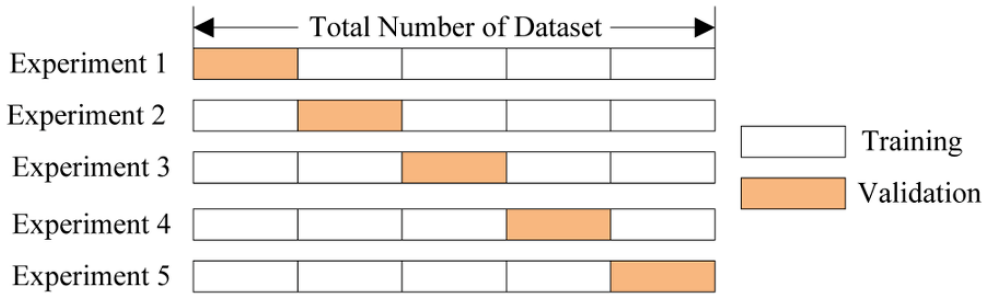
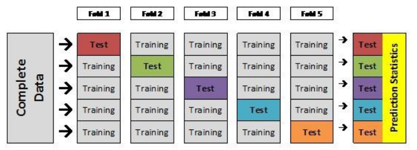

# K-Fold cross Validation(교차검증)

> K개의 fold를 만들어서 진행하는 교차 검증

### 사용이유

- 총 데이터 갯수가 적은 데이터 셋에 대해 정확도를 향상 시키기 위함

- Training / Validation / Test 총 세 개의 집단으로 분류하는 것 보단, Training 과 Test 로만 분류할 때 학습 데이터 셋이 더 많기 때문

- 데이터 수가 적은데 검증과 테스트에 데이터를 더 뺐기면 underfitting 등 성능이 미달되는 모델이 학습되기 때문

  

### 과정
1. 기존 과정과 같이 Training set과 test set을 나눔
2. Training을 K개의 fold로 나눔
3. 위는 5개의 fold로 나위었을 때 모습임
4. 한 개의 fold에 있는 데이터를 다시 K개로 쪼갠 다음, K-1개는 traning data, 마지막 한 개는Validation Data set으로 지정
5. 모델을 생성하고 예측을 진행하여 에러값을 추출함
6. 다음 fold에서 Validation set을 바꿔 지정하고, 이전 fold에서 Validation 역활을 했던 set은 다시 Training set으로 활용
7. 이를 K번 반복

   

### 과정 2

1. 각각 fold의 시도에서 기록된 error를 바탕(error들의 평균)으로 최적의 모델(조건)을 찾는다

2. 해당 모델을 바탕으로 전체 Training set의 학습을 진행

3. 해당 모델을 처음에 분할하였던 test set 을 활용하여 평가를 진행

### 단점

1. 일반적인 학습 방법에 비해 시간이 많이 걸림

### 참고

1. 참고1 :  https://nonmeyet.tistory.com/entry/KFold-Cross-Validation%EA%B5%90%EC%B0%A8%EA%B2%80%EC%A6%9D-%EC%A0%95%EC%9D%98-%EB%B0%8F-%EC%84%A4%EB%AA%85