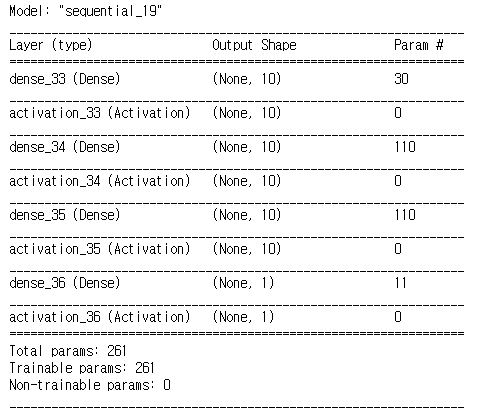
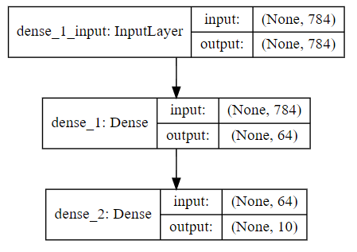
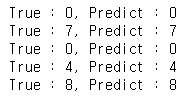

# Keras

> 1. 머신러닝 라이브러리 Theano와 TensorFlow를 래핑한 라이브러리
>2. Sequential로 딥러닝의 각 층을 add()로 추가
> 3. 활성화 함수, Dropout 등 add()로 간단하게 추가
>4. compile()로 모델 구축
> 5. loss 로 최적화 함수 지정
>6. fit() 로 모델에 데이터를 학습시킴
> 7. Keras로 머신러닝을 수행할 때 Numpy 배열 데이터를 전달해야 한다
>8. pip install keras


## 1. 모델 생성/학습

### 1.1 모델 생성

> Sequential 함수를 통해 딥러닝의 구조를 짜고 층을 설정한다.

```python
model = Sequential()
```

#### 레이어 생성

- Dense : 입출력을 모두 연결해주는 레이어 이다.
  - 예시로 입력 뉴런이 4개, 출력 뉴런이 8개있다면 총 연결선은 32개(4*8=32) 입니다. 
  - 각 연결선에는 가중치(weight)를 포함하고 있는데, 이 가중치가 나타내는 의미는 연결강도라고 보시면 됩니다.
  -  현재 연결선이 32개이므로 가중치도 32개입니다.

```python
Dense(8, input_dim=4, init='uniform', activation='relu'))
```

- 첫번째 인자 : 출력 뉴런의 수를 설정
- input_dim : 입력 뉴런의 수를 설정
- init : 가중치 초기화 방법 설정
  - ‘uniform’ : 균일 분포
  - ‘normal’ : 가우시안 분포
- activation : 활성화 함수 설정
  - linear : 디폴트 값, 입력뉴런과 가중치로 계산된 결과값이 그대로 출력으로 나옴
  - relu : rectifier 함수, 은익층에 주로 쓰임
    - 미분시 기울기가 양수는 1, 음수는 0
  - reakyrelu: 미분시 기울기가 양수는 1, 음수는 0.1
    - 딥러닝에서는 많이 쓰임
  - sigmoid : 시그모이드 함수, 이진 분류 문제에서 출력층에 주로 쓰임
    - 문제가 있다. 
    - 미분시 값이 0이 많이 생긴다. 
    - 역전파에서 가중치를 곱할때 0으로 되므로 기울기 소실 문제가 발생한다(gradient vanishing).
  - softmax : 소프트맥스 함수, 다중 클래스 분류 문제에서 출력층에 주로 쓰임

> 1. Dense 레이어는 입력 뉴런 수에 상관없이 출력 뉴런 수를 자유롭게 설정할 수 있기 때문에 출력층으로 많이 사용된다 
> 2. 이진 분류문제에서는 0과 1을 나타내는 출력 뉴런이 하나만 있으면 되기 때문에 아래 코드처럼 출력 뉴런이 1개이고, 입력 뉴런과 가중치를 계산한 값을 0에서 1사이로 표현할 수 있는 활성화 함수인 sigmoid을 사용한다.

- 예시

  ```python
  df
  ```

  


### 1.2 모델 학습

> 케라스에서 만든 모델을 학슬할 때 filt() 함수를 사용 

```python
model.fit(x, y, batch_size=32, epochs=10)
#시험문제와 관련해서 예시를 들자면
#1. x : 입력 데이터, 100문항의 문제
#2. y : 라벨 값, 100문항의 답
#3. batch_size : 몇 개의 샘플로 가중치를 갱신할 것인지 지정
    #몇 문항을 풀고 답을 풀어볼지 정하는 것, 100이면 100문제를 풀고 해답을 맞춰 보는거, 3이면 3문제를 풀고 3개답을 맞춰 보는거
#4. epochs : 학습 반복 횟수
    #모의고사 1회분을 몇번 풀어볼지 정하는 거, 20이면 100문제를 20번 푸는 것
```


#### 질문 1. 에포크를 무조건 늘리면 좋은가?

 ```
하나의 문제집만 계속 학습하면 오히려 역효과가 발생할 수 있습니다. 
피아노 칠 때 처음에 곡을 연습할 때는 악보를 보면서 치다가 다음엔 악보안보고도 치고, 나중엔 눈감고도 칩니다. 
눈감고만 치다보면 악보 보는 법을 까먹게 되고 다른 곡을 치지 못하는 지경에 이릅니다. 
연습한 곡은 완벽하게 칠 지 몰라도 다른 곡은 치지 못하는 상태가 됩니다. 우린 이것을 `오버피팅(overfitting)`이라고 부릅니다. 
악보보고 잘 치는 정도에서 그만 연습하는 것이 더 좋았을 수 있습니다. 실제로 모델을 학습할 때도 오버피팅이 일어나는 지 체크하다가 조짐이 보이면 학습을 중단합니다.
출처: https://tykimos.github.io/2017/03/25/Fit_Talk/
 ```

#### 질문2. predict_classes() 함수는 Sequential 기반 모델에서만 사용가능한가?

```
그렇다. functional API 기반 모델은 다수개의 입출력으로 구성된 다양한 모델을 구성할 수 있기 때문에 예측함수의 출력 형태 또한 다양하다. 
따라서 클랙스 인덱스를 알려주는 간단한 예측함수는 제공하지 않는다.
```


### 1.3 모델 정보 확인

https://keras.io/models/about-keras-models/


## 2. 모델 학습과정 표시

> fit을 통해 학습을 진행할 경우 화면에 여러 수치들이 로그로 표시된다. 이 로그로 학습을 중단할지 계속할지 판단하는 중요한 척도가 되는데 이를 그래프로 보면 더 직관적일 것이다.
>
> 그래프로 한번 보자!


#### 2.1 히스토리 기능

> 사용은 모델.history 형식으로 사용한다.

```python
model = Sequential() 
model.add(Dense(10,input_dim=2)) #1번째 히든층 , (노드수 * input) + bias(node) 수
model.add(Activation('sigmoid'))

model.add(Dense(10)) #출력 층 
model.add(Activation('sigmoid'))

model.add(Dense(10)) #출력 층 
model.add(Activation('sigmoid'))

model.add(Dense(1)) #출력 층 
model.add(Activation('sigmoid'))


model.summary()
#입력데이터가 몇개인지 모르기 때문에 출력이 None으로 나옴
#학습한 파라미터는 261개 , 학습되지 않은 파라미터는 0개
```



> Total params: 
>
> 파라미터 값 구하는 공식, (input*층 노드수) + 바이어스 

## 3. 학습모델 보기/저장/불러오기

### 3.1 학습모델 보기

```python
#사전에 graphviz를 설치해야 한다., conda install graphviz
from IPython.display import SVG
from keras.utils.vis_utils import model_to_dot

%matplotlib inline

SVG(model_to_dot(model, show_shapes=True, dpi=70).create(prog='dot', format='svg'))
#https://www.tensorflow.org/api_docs/python/tf/keras/utils/model_to_dot
```




### 3.2 학습모델 저장

#### 1. 전체 저장

```python
model.save('model.h5')
```

#### 2. 아키텍처 저장(json 형식) 

```python
model_json = model.to_json()
with open("model.json", "w") as json_file : 
json_file.write(model_json)
```

#### 3. Weight 저장

```python
#Weight를 h5 파일 포맷으로 만들어 저장하기
model.save_weights("model.h5")
```


### 3.3 학습모델 불러오기

> 1. 모델 불러오는 함수를 이용하여 앞서 저장한 모델 파일로부터 모델을 재형성한다.
>
> 2. 실제 데이터로 모델을 사용한다. 이 때 주로 사용되는 함수가 predict() 함수이지만 Sequential 기반의 
>
>    분류 모델을 사용할 경우 좀 더 편리하게 사용할 수 있도록 predict_classes() 함수를 제공한다. 이 함수를 이용하면 가장 확률이 높은 클래스 인덱스를 알려준다.

#### 1. 전체 불러오기

```python
from keras.models import load_model
model = load_model('model.h5')

# 3. 모델 사용하기
yhat = model.predict_classes(xhat)
for i in range(5):
    print('True : ' + str(argmax(y_test[xhat_idx[i]])) + ', Predict : ' + str(yhat[i]))
```



#### 2. 아키텍처 불러오기(json 형식)

```python
from keras.models import load_model
json_file = open("model.json", "r") 
loaded_model_json = json_file.read() 
json_file.close() 
loaded_model = model_from_json(loaded_model_json)
#가중치도 따로 불러와야 한다....아키텍처만 불러오는것이므로
```

#### 3. weight 불러오기 및 모델에 적용하기

```python
loaded_model.load_weights("model.h5")

# 모델 컴파일
loaded_model.compile(loss="binary_crossentropy", optimizer="rmsprop", metrics=['accuracy'])
# 모델 평가
score = loaded_model.evaluate(X,Y,verbose=0)
print("%s : %.2f%%" % (loaded_model.metrics_names[1], score[1]*100))

```

### 실습자료

1. Image-analysis-and-develope/Deep_Learning/20200113/1.1_keras_model_save_read_view.ipynb


## 참고자료

1. https://tykimos.github.io/2017/01/27/MLP_Layer_Talk/