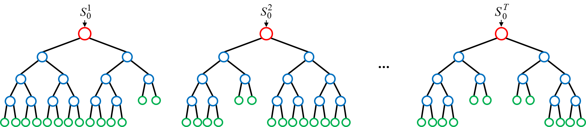

# Random forest

> 1. 의사결정트리를 기반으로 만들어진 알고리즘
>
> 2. 여러개의 결정트리 classifier가 생성되며 각자의 방식으로 데이터를 sampling 하여 개별적으로 학습하는 방식이다. 
> 3. 앙상블 알고리즘 중 하나이다.
> 4. 각 결정트리에서 얻은 결과를 다수결로 결정하는 방식




## 하이퍼파라미터

```python
class sklearn.ensemble.RandomForestClassifier(n_estimators=100, criterion='gini', max_depth=None, min_samples_split=2, min_samples_leaf=1, min_weight_fraction_leaf=0.0, max_features='auto', max_leaf_nodes=None, min_impurity_decrease=0.0, min_impurity_split=None, bootstrap=True, oob_score=False, n_jobs=None, random_state=None, verbose=0, warm_start=False, class_weight=None, ccp_alpha=0.0, max_samples=None)[source]
```

1. n_estimatorsinteger - optional (default=100)
   - The number of trees in the forest.
2. criterionstring, optional (default=”gini”)
   - The function to measure the quality of a split. Supported criteria are “gini” for the Gini impurity and “entropy” for the information gain. Note: this parameter is tree-specific.
3. max_depthinteger or None, optional (default=None)
   - The maximum depth of the tree. If None, then nodes are expanded until all leaves are pure or until all leaves contain less than min_samples_split samples.
4. min_samples_splitint, float, optional (default=2)
   - The minimum number of samples required to split an internal node:
   - If int, then consider min_samples_split as the minimum number.
   - If float, then min_samples_split is a fraction and ceil(min_samples_split * n_samples) are the minimum number of samples for each split.

> 위와 관련된 파라미터는 다음의 주소에 있다.
>
> [사이킷런공식주소_랜덤포레스트](https://scikit-learn.org/stable/modules/generated/sklearn.ensemble.RandomForestClassifier.html)


## 실습

1. [랜덤포레스트](https://github.com/madfalc0n/Image-analysis-and-develope/blob/master/Machine_Learning/20200106/1.1_wine_quality_predict_random_forest.ipynb)