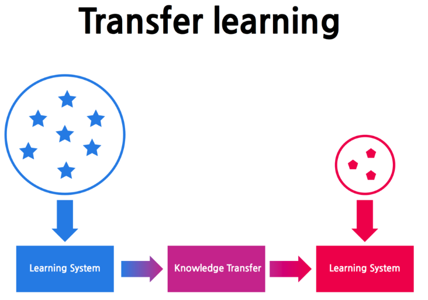

# Transfer Learning과 Pre-trained model

## Transfer Learning(전이학습)이란 무엇인가?

특정 문제를 해결하는 동안 얻은 지식을 저장하고 다른 문제에 적용하는 것에 중점을 둔 머신러닝 연구과제이다. **유도성 전이(inductive transfer)**라고도 한다.

> 출처: [LG CNS](https://post.naver.com/viewer/postView.nhn?volumeNo=10436992&memberNo=3185448&searchKeyword=%ED%94%8C%EB%A1%9C%EC%9A%B0&searchRank=372)

딥러닝에서 신경망을 훈련할 때 주어진 데이터셋을 통해 학습을 한다. 학습을 통해 훈련된 신경망은 주어진 데이터 셋으로부터 학습하는데 도움이 되는 약간의 가중치를 가지고 있다.  이 가중치를 이진 형식으로 추출하여 다른 신경망으로 전이가 가능한데 처음부터 신경망을 훈련하는 대신, 이전에 훈련된 모델에서 얻은 지식을 전달하는 것이다.

## Pre-trained Model 이란?

간단하게 말하면 **사전에 훈련된 모델**이라는 뜻이다. 특정 문제를 해결하기 위해 다른사람이 생성해 구축해 둔 모델을 말하며 미리 훈련을 마친 모델을 사용할 수 있다는 점을 의미하기도 한다.

### Pre-trained model을 사용해야 하는 이유?

모델을 처음부터 만들려고 한다면 엄청난 시간이 든다는 것이 주 이유이다. 어플리케이션 개발에서 알고리즘 개발에서 시간을 허비한다면 초점을 잃을 것이며 사전훈련된 모델을 사용해 시간을 아끼고 어플리케이션 개발에 집중할 수 있기 때문이다.

### Pre-trained model을 사용하는 방법?

보통 사전훈련된 모델은 **이진형식**으로 되어 있으며 이것을 내려 받아서 자신의 어플리케이션에서 사용할 수 있다. `케라스(Keras)`, `텐서플로(Tensorflow)`, `다크넷(Darknet)`과 같은 일부 라이브러리에는 사용 가능한 특정 API를 적재하면 바로 사용할 수 있는 사전 모델이 이미 있다.