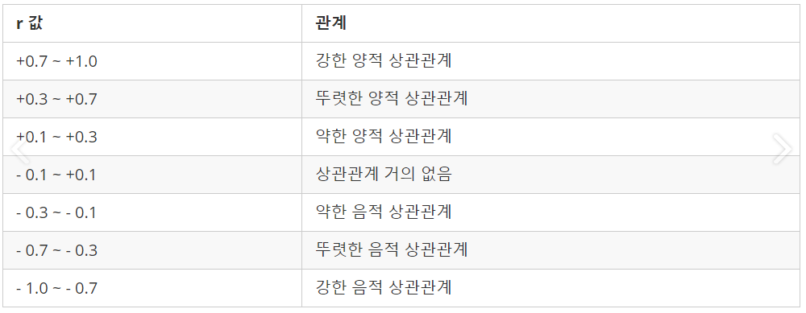
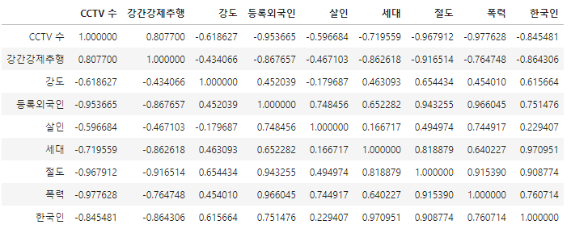

# correlation coefficient(상관계수)

> 2개 이상의 양적인 변수간 관계가 유의한지 확인하는 방법
>
> 인터넷 이용 횟수와 수학 성적간의 관계, 독서실 이용률과 스트레스 지수 간의 관계를 예로 들수 있다.
>
> 파이썬에서는 pearson correlation coefficient를 구할 수 있는 corr(), corrwith()함수를 제공함

## 정의

1. r = x,y가 함께 변하는 정도
2. x,y가 각각 변하는 정도

## 해석 방법

- r 값은 x와 y가 완전히 동일하면 +1, 전혀 다르면 0, 반대방향으로 완전히 동일하면 -1의 값을 갖는다.

### 파이썬에서 사용방법

`df.corr()` 적용 

이런식으로 나온다...

예시... `CCTV 수` 와 연관된 항목 중 상관관계가 높은 3개를 뽑자면 폭력(-0.977...), 절도(-0.967..), 등록외국인(-0.956...) 을 볼 수 있다.

값들이 음수인것으로 보아 `CCTV 수가 높을수록  위 3개 항목의 수치는 작아진다`고 판단할 수 있다.