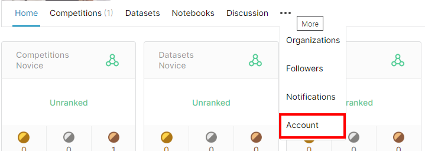
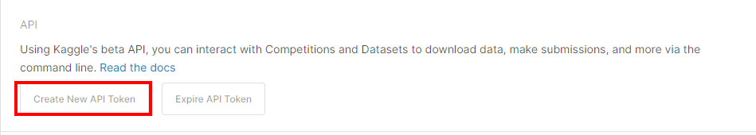
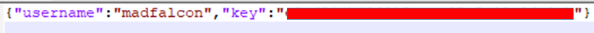
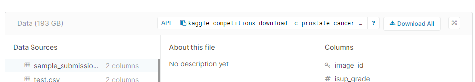

# Kaggle API User manual

Kaggle API에 대한 사용자 매뉴얼이다. **`Linux`** 환경에 대한 매뉴얼이고 자세한 내용은 [kaggle github](https://github.com/Kaggle/kaggle-api)에서 확인 가능하니 참고하시오.


## 1. Kaggle 모듈 설치

모듈을 설치하기 전 `Python3`와 `pip`모듈이 설치되어 있어야한다. 아래와 같이 입력하자

```bash
(sudo) pip install --user kaggle
```

`--user`를 따로 입력하지 않아도 되지만 캐글에서는 설치과정에서 문제가 발생할 수 있어 추가하는 것을 권장하고 있다.

## 2. API Credentials 생성

[kaggle](https://www.kaggle.com/)에 접속해서 개인프로파일의 `Account` 탭으로 이동한다.



API 항목에서 `Create New API Token`을 클릭하면 `kaggle.json`이름의 파일이 다운로드 된다. 내용은 다음과 같다.



형식은 username 과 key 뿐이다.




해당 파일을 다음의 경로에 붙여넣어 준다.

```bash
~/.kaggle/kaggle.json
#나같은 경우 아래의 경로처럼 복사하였음
#/home/lab03/.kaggle/kaggle.json
```

시스템을 원격으로 사용하는 사용자일 경우 `touch kaggle.json`을 입력하여 파일을 생성하고 로컬에서 다운받은 json 파일의 내용을 복사하여 붙여넣기 해도 상관없다.


## 3. Dataset 다운로드

자신이 참여하고있는 competetion의 데이터 항목으로 이동하여 API를 복사한다.



자신이 원하는 경로로 이동하여 복사한 API를 입력하면된다. 압축파일로 현재경로에 다운로드 된다.

```bash
kaggle competitions download -c prostate-cancer-grade-assessment
```

