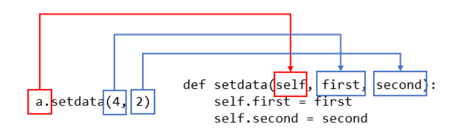

# 클래스와 객체

원글 : [점프 투 파이썬](https://wikidocs.net/28)

## 정의

`클래스(class)`란 똑같은 무엇인가를 계속해서 만들어 낼 수 있는 **설계 도면**이고(과자 틀)

`객체(object)`란 클래스로 만든 **피조물**(과자 틀을 사용해 만든 과자)을 뜻한다.

```markdown
클래스 : 과자 틀

객체 : 과자 틀에 의해 만들어진 과자
```

## 특징

클래스로 만든 객체에는 중요한 특징이 있다. 바로 객체마다 고유한 성격을 가진다는 것이다.

과자 틀로 만든 과자에 구멍을 뚫거나 조금 베어 먹더라도 다른 과자에는 아무 영향이 없는 것과 마찬가지로 동일한 클래스로 만든 객체들은 서로 전혀 영향을 주지 않는다.

## 예시

클래스의 가장 간단한 예시다

```python
class Cookie:
	pass
```

위의 클래스는 아무 기능도 갖고 있지 않은 껍질뿐인 클래스이다. 하지만 이렇게 껍질뿐인 클래스도 객체를 생성하는 기능이 있다. "과자 틀"로 "과자"를 만드는 것처럼 말이다.

객체는 클래스로 만들며 1개의 클래스는 무수히 많은 객체를 만들어 낼 수 있다. 위에서 만든 Cookie 클래스의 객체를 만드는 방법은 다음과 같다.

```python
a = Cookie()
b = Cookie()
```

`Cookie()`의 결괏값을 돌려받은 a와 b가 바로 객체이다. 마치 함수를 사용해서 그 결괏값을 돌려받는 모습과 비슷하다.

## 객체와 인스턴스의 차이

클래스로 만든 객체를 **인스턴스**라고도 한다. 그렇다면 객체와 인스턴스의 차이는 무엇일까? 이렇게 생각해 보자. 

`a = Cookie()` 이렇게 만든 a는 **객체**이다. 그리고 a 객체는 Cookie의 인스턴스이다. 즉 **인스턴스**라는 말은 특정 객체(a)가 어떤 클래스(Cookie)의 객체인지를 관계 위주로 설명할 때 사용한다. `a는 인스턴스`보다는 `a는 객체`라는 표현이 어울리며 `a는 Cookie의 객체`보다는 `a는 Cookie의 인스턴스`라는 표현이 훨씬 잘 어울린다.

## 사칙연산 클래스 만들어보기

1. 클래스를 먼저 만들어준다.

```python
class FourCal:
	pass #pass 는 아무것도 수행하지 않는 문법으로 임시로 코드를 작성할 때 사용
a = FourCal() #객체 생성
print(type(a)) # <class '__main__.FourCal'>
```

2. 객체에 숫자 지정할 수 있게 만들기

   연산을 수행할 대상을 객체에 지정 할 수 있게 생성해보자. 

```python
class FourCal:
        def setdata(self, first, second):
            self.first = first
            self.second = second
            return self.first + self.second
        
a = FourCal() #객체 생성
value = a.setdata(4,2)
print(value) # 6
```



파이썬 메서드의 첫 번째 매개변수 이름은 관례적으로 self를 사용한다. 객체를 호출할 때 호출한 객체 자신이 전달되기 때문에 self를 사용한 것이다. 물론 self말고 다른 이름을 사용해도 상관없다.

> ※ 메서드의 첫 번째 매개변수 self를 명시적으로 구현하는 것은 파이썬만의 독특한 특징이다. 예를 들어 자바 같은 언어는 첫 번째 매개변수 self가 필요없다.

``` python
class FourCal:
        def setdata(self, first, second):
            self.first = first
            self.second = second
        def add(self):
            return self.first + self.second
        def mul(self):
            return self.first * self.second
        def sub(self):
            return self.first - self.second
        def div(self):
            return self.first / self.second
        
        
a = FourCal() #객체 생성
a.setdata(4,2)
print(a.add(), a.sub(), a.mul(), a.div())
# 6 2 8 2.0 으로 나온다.
```


## 생성자

우리가 만든 FoulCal 클래스를 다음과 같이 사용해보자.

```python
class FourCal:
        def setdata(self, first, second):
            self.first = first
            self.second = second
        def add(self):
            return self.first + self.second
        def mul(self):
            return self.first * self.second
        def sub(self):
            return self.first - self.second
        def div(self):
            return self.first / self.second
        
        
a = FourCal() #객체 생성
a.add()
"""
Traceback (most recent call last):
  File "<stdin>", line 1, in <module>
  File "<stdin>", line 6, in add
AttributeError: 'FourCal' object has no attribute 'first'
"""
```

> 에러가 발생한다.

FourCal 클래스의 인스턴스 a에 setdata 메서드를 수행하지 않고 add 메서드를 수행하면 `AttributeError: 'FourCal' object has no attribute 'first'` 오류가 발생한다. setdata 메서드를 수행해야 객체 a의 객체변수 first와 second가 생성되기 때문이다.

이렇게 객체에 초깃값을 설정해야 할 필요가 있을 때는 setdata와 같은 메서드를 호출하여 초깃값을 설정하기보다는 생성자를 구현하는 것이 안전한 방법이다. **생성자(Constructor)**란 객체가 생성될 때 자동으로 호출되는 메서드를 의미한다.

 `_ _init_ _( )` 함수는 이 class에서 사용할 변수를 정의하는 함수이다. `_ _init_ _( )` 함수의 첫번째 매개변수는 반드시 self 변수를 사용해야 한다. self 변수는 클래스에서 생성된 인스턴스에 접근하는 예약어이다.

```python
class FourCal:
        def __init__(self, first, second):
            self.first = first
            self.second = second
        def setdata(self, first, second):
            self.first = first
            self.second = second
        def add(self):
            return self.first + self.second
        def mul(self):
            return self.first * self.second
        def sub(self):
            return self.first - self.second
        def div(self):
            return self.first / self.second
a = FourCal(4, 2)
print(a.add(), a.mul(), a.sub(), a.div())
```

`__init__` 메서드는 setdata 메서드와 이름만 다르고 모든 게 동일하다. 단 메서드 이름을 `__init__`으로 했기 때문에 생성자로 인식되어 객체가 생성되는 시점에 **자동으로 호출**되는 차이가 있다.