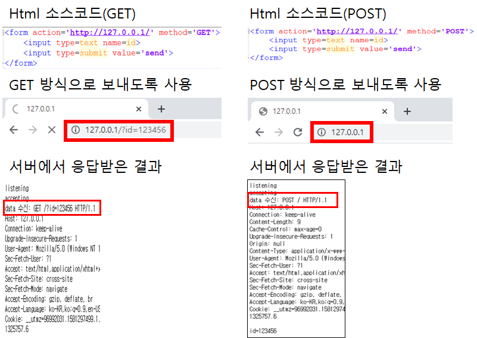

## 파이썬 소켓 프로그래밍을 통한 실습

> 소켓 프로그래밍을 시작하기 앞서 프로토콜 패밀리에 대해 숙지해야할 필요가 있다.
>
> [https://jjoreg.tistory.com/entry/%EC%97%B4%ED%98%88%EA%B0%95%EC%9D%98-TCPIP](https://jjoreg.tistory.com/entry/열혈강의-TCPIP)

**프로토콜 패밀리는 아래와 같은 종류가 있다.**

| **프로토콜 체계(Protocol Family)** | **정의**                               |
| ---------------------------------- | -------------------------------------- |
| **PF_INET**                        | **IPv4인터넷 프로토콜**                |
| **PF_INET6**                       | **IPv6인터넷 프로토콜**                |
| **PF_LOCAL**                       | **LOCAL 통신을 위한 UNIX 프로토콜**    |
| **PF_PACKET**                      | **Low level socket을 위한 인터페이스** |
| **PF_IPX**                         | **IPX 노벨 프로토콜**                  |

 **AF_INET는 주소 패밀리중 하나입니다. 종류는 아래와 같습니다.**

| **주소체계(Address Family)** | **정의**                                                     |
| ---------------------------- | ------------------------------------------------------------ |
| **AF_INET**                  | **IPv4인터넷 프로토콜**                                      |
| **AF_INET6**                 | **IPv6인터넷 프로토콜**                                      |
| **AF_LOCAL**                 | **LOCAL 통신을 위한 UNIX 프로토콜\**[출처]\** [PF_INET 와 AF_INET 의 차이점](http://blog.naver.com/l18400/60109296392)\|\**작성자\** [l18400](http://blog.naver.com/l18400)** |


**소켓을 만들 때는 소켓이 사용될 환경을 고려해 프로토콜을 설정해 주어야 합니다.**

**다시 말해 프로토콜 패밀리는 소켓을 생성할 때 이 소켓이 어떤 프로토콜을 사용해 통신을 할지 정해줍니다.**

**참고로 소켓은 네트워크 통신을 할때만 사용되는 것은 아닙니다.**

**유닉스 계열의 시스템에서 시스템 내부의 프로세스들끼리 통신을 하기 위해서도 사용됩니다.**

**자주 사용되는 PF_INET는 프로토콜 패밀리중 하나입니다.**


### 서버 코드

```python
import socket

server_socket = socket.socket(socket.AF_INET, socket.SOCK_STREAM)
#AF_INET는 주소 체계(주소 패밀리)중 하나
#AF_INET 은 IPv4 를 사용하겠다는 의미
#socket.SOCK_STREAM 타입 커넥션 기반 TCP protocol
#socket.SOCK_DGRAM 타입 데이터그램 기반 UDP protocol

server_socket.bind(('localhost', 12345)) # localhost : 12345 번 할당 
server_socket.listen(0) # 12345 포트로 listen 하고있겠다 -> 포트를 오픈하겠다.
print("listening")
client_socket, addr = server_socket.accept() #
print("accepting")

data = client_socket.recv(65535) 
print("data 수신: "+data.decode()) # 디코딩 처리, 한글코드같은 unicode를 인식하기 위함

client_socket.send(data) # 받은 데이터를 다시 보냄
print("클라이언트에게 받은 데이터를 다시 send")

client_socket.close()
print("소켓통신 close")
```


### 클라이언트 코드

```python
import socket

sock = socket.socket(socket.AF_INET, socket.SOCK_STREAM)

sock.connect(('localhost', 12345))
print("서버 접속 성공")
sock.send('hello'.encode()) #서버에게 'hello' 보냄
print("send message")

data = sock.recv(65535) #byte 형식으로 데이터를 받으므로 디코딩이 필요하다
print("서버로 부터 데이터 수신: "+data.decode())
print("종료")
```


### 통신 결과




### 실습

- [실습내용](https://github.com/madfalc0n/Image-analysis-and-develope/tree/master/web/20200211)

 

